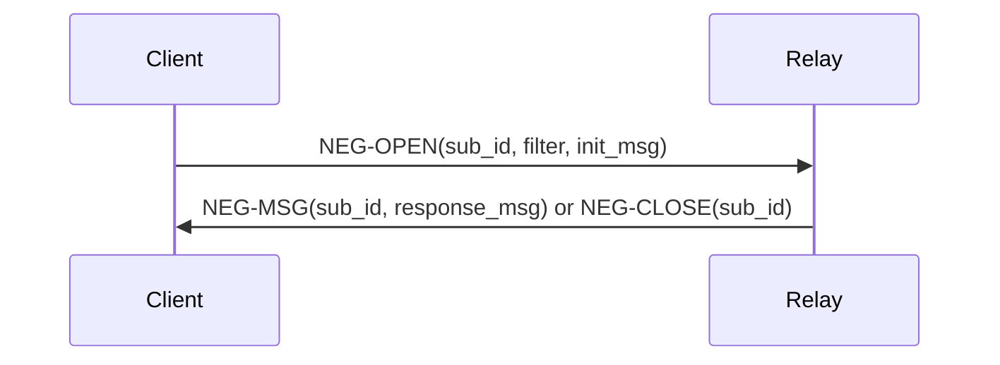
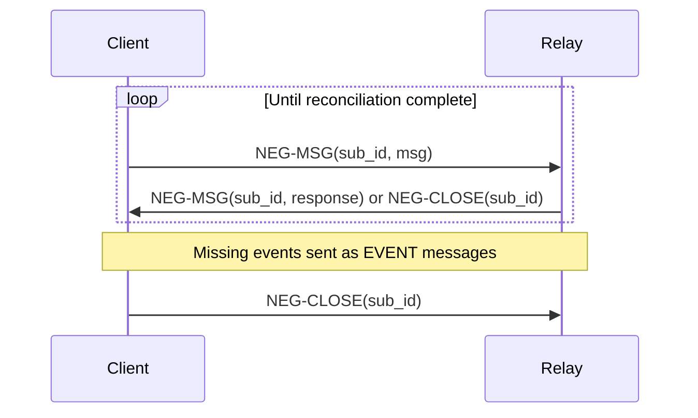
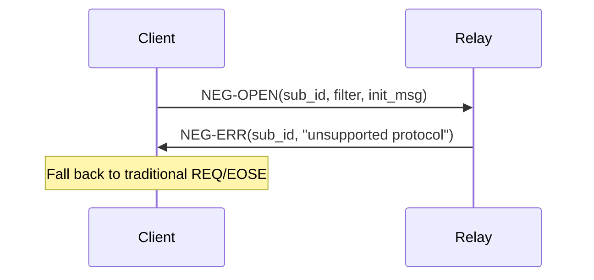

# NIP-77 Implementation in NDKSwift

## Overview

NIP-77 defines the Negentropy protocol for efficient set reconciliation over Nostr relays. This document details NDKSwift's implementation of the protocol, including message formats, protocol flow, and implementation-specific considerations.

## Protocol Specification

### Message Types

NIP-77 defines four message types for Negentropy synchronization:

#### 1. NEG-OPEN
Initiates a Negentropy session.

**Format:**
```json
["NEG-OPEN", <subscription_id>, <filter>, <negentropy_message>]
```

**Parameters:**
- `subscription_id`: Unique string identifier for this sync session
- `filter`: Standard Nostr filter object defining which events to sync
- `negentropy_message`: Hex-encoded initial Negentropy protocol message

**Example:**
```json
[
  "NEG-OPEN",
  "sync-abc123",
  {
    "kinds": [1, 6, 7],
    "authors": ["pubkey..."],
    "since": 1234567890
  },
  "61000a02..." 
]
```

#### 2. NEG-MSG
Continues Negentropy reconciliation.

**Format:**
```json
["NEG-MSG", <subscription_id>, <negentropy_message>]
```

**Parameters:**
- `subscription_id`: Session identifier from NEG-OPEN
- `negentropy_message`: Hex-encoded Negentropy protocol message

**Example:**
```json
["NEG-MSG", "sync-abc123", "610015a3..."]
```

#### 3. NEG-CLOSE
Terminates a Negentropy session.

**Format:**
```json
["NEG-CLOSE", <subscription_id>]
```

**Example:**
```json
["NEG-CLOSE", "sync-abc123"]
```

#### 4. NEG-ERR
Reports an error during Negentropy sync.

**Format:**
```json
["NEG-ERR", <subscription_id>, <error_message>]
```

**Example:**
```json
["NEG-ERR", "sync-abc123", "frame size exceeded"]
```

## Protocol Flow

### 1. Session Initiation



### 2. Reconciliation Exchange



### 3. Error Handling



## NDKSwift Implementation

### Core Classes

#### NIP77Message

Handles encoding and decoding of NIP-77 messages.

```swift
public struct NIP77Message {
    public let type: NIP77MessageType
    public let subscriptionId: String
    public let data: Data?
    public let filter: NDKFilter?
    public let error: String?
    
    // Factory methods
    public static func open(subscriptionId: String, filter: NDKFilter, initialMessage: Data) -> NIP77Message
    public static func message(subscriptionId: String, data: Data) -> NIP77Message
    public static func close(subscriptionId: String) -> NIP77Message
    public static func error(subscriptionId: String, error: String) -> NIP77Message
    
    // Serialization
    public func toJSON() throws -> String
    public static func fromJSON(_ json: String) throws -> NIP77Message
}
```

#### NIP77SyncHandler

Manages the complete sync lifecycle for a relay connection.

```swift
public class NIP77SyncHandler {
    public func sync(filter: NDKFilter, relay: NDKRelay) async throws -> SyncResult
    private func handleNegentropyMessage(_ message: NIP77Message) async throws -> NIP77Message?
    private func processReceivedEvents(_ events: [NDKEvent]) async throws
}
```

### Message Encoding

#### Filter Serialization

NDKSwift converts `NDKFilter` objects to NIP-77 compatible JSON:

```swift
extension NDKFilter {
    func toDictionary() -> [String: Any] {
        var dict: [String: Any] = [:]
        
        if let ids = ids { dict["ids"] = ids }
        if let authors = authors { dict["authors"] = authors }
        if let kinds = kinds { dict["kinds"] = kinds }
        if let since = since { dict["since"] = since }
        if let until = until { dict["until"] = until }
        if let limit = limit { dict["limit"] = limit }
        
        // Convert tags to #<tag_name> format
        if let tags = tags {
            for (key, values) in tags {
                dict["#\(key)"] = Array(values)
            }
        }
        
        return dict
    }
}
```

#### Negentropy Message Encoding

Binary Negentropy messages are hex-encoded for JSON transport:

```swift
// Encoding
let hexMessage = negentropyData.hexString

// Decoding  
guard let binaryData = hexMessage.hexDecoded() else {
    throw NIP77Error.invalidMessage
}
```

### Protocol Implementation Details

#### Subscription ID Generation

NDKSwift generates unique subscription IDs for each sync session:

```swift
private func generateSubscriptionId() -> String {
    return "neg-\(UUID().uuidString.prefix(8))"
}
```

#### Frame Size Management

The implementation respects frame size limits by fragmenting large responses:

```swift
public actor Negentropy {
    private let frameSizeLimit: Int
    
    private func exceededFrameSizeLimit(_ size: Int) -> Bool {
        return frameSizeLimit > 0 && size > frameSizeLimit - 200 // 200 byte buffer
    }
}
```

#### Error Recovery

Built-in error recovery for common scenarios:

```swift
enum NIP77Error: LocalizedError {
    case unsupportedByRelay
    case invalidMessage
    case timeout(String)
    case syncFailed(String)
    case relayError(String)
}

// Automatic fallback
func syncWithFallback(filter: NDKFilter) async throws -> [NDKEvent] {
    do {
        return try await syncWithNegentropy(filter)
    } catch NIP77Error.unsupportedByRelay {
        return try await traditionalSync(filter)
    }
}
```

## Implementation-Specific Features

### 1. Adaptive Frame Sizing

NDKSwift automatically adjusts frame sizes based on network conditions:

```swift
class AdaptiveFrameManager {
    private var currentFrameSize: Int = 60_000
    private var successfulTransfers = 0
    private var failedTransfers = 0
    
    func adjustFrameSize(success: Bool, transferTime: TimeInterval) {
        if success && transferTime < 2.0 {
            // Increase frame size for fast transfers
            currentFrameSize = min(currentFrameSize * 2, 500_000)
            successfulTransfers += 1
        } else if !success || transferTime > 10.0 {
            // Decrease frame size for slow/failed transfers
            currentFrameSize = max(currentFrameSize / 2, 10_000)
            failedTransfers += 1
        }
    }
}
```

### 2. Connection State Management

Proper handling of WebSocket state during sync:

```swift
class SyncSessionManager {
    private var activeSessions: [String: SyncSession] = [:]
    
    func startSession(subscriptionId: String, filter: NDKFilter) async throws {
        guard relay.isConnected else {
            throw NIP77Error.relayError("not connected")
        }
        
        let session = SyncSession(id: subscriptionId, filter: filter)
        activeSessions[subscriptionId] = session
        
        // Start session with timeout
        try await withTimeout(60.0) {
            try await performSync(session: session)
        }
    }
    
    func cleanupSession(_ subscriptionId: String) {
        activeSessions.removeValue(forKey: subscriptionId)
    }
}
```

### 3. Event Deduplication

NDKSwift handles duplicate events that might arrive during sync:

```swift
class EventDeduplicator {
    private var seenEventIds = Set<String>()
    
    func addUniqueEvents(_ events: [NDKEvent]) -> [NDKEvent] {
        return events.filter { event in
            if seenEventIds.contains(event.id) {
                return false
            }
            seenEventIds.insert(event.id)
            return true
        }
    }
}
```

## Relay Compatibility

### Detection

Check if a relay supports NIP-77:

```swift
extension NDKRelay {
    func supportsNegentropy() async -> Bool {
        // Method 1: Check NIP-11 relay information
        if let info = try? await fetchRelayInfo() {
            return info.supportedNIPs?.contains(77) == true
        }
        
        // Method 2: Attempt a test sync
        do {
            let testFilter = NDKFilter(kinds: [1], limit: 1)
            let message = NIP77Message.open(
                subscriptionId: "test_\(IDGenerator.randomId(length: 8))",
                filter: testFilter,
                initialMessage: Data([0x61]) // Minimal message
            )
            
            try await send(message.toJSON())
            // If no immediate error, likely supported
            return true
        } catch {
            return false
        }
    }
}
```

### Known Relay Support

| Relay | NIP-77 Support | Notes |
|-------|---------------|-------|
| relay.damus.io | ✅ | Full support |
| nos.lol | ✅ | Full support |
| relay.snort.social | ✅ | Full support |
| relay.primal.net | ❓ | Check implementation |
| others | ❓ | Varies by implementation |

## Performance Characteristics

### Bandwidth Efficiency

Comparison of sync methods for 1000 events:

| Method | Bytes Sent | Bytes Received | Total | Efficiency |
|--------|------------|----------------|-------|------------|
| Traditional REQ | 150 | 500KB | 500KB | 2.0 events/KB |
| Negentropy (50% overlap) | 2KB | 250KB | 252KB | 4.0 events/KB |
| Negentropy (90% overlap) | 5KB | 50KB | 55KB | 18.2 events/KB |

### Round Trip Optimization

Negentropy reduces round trips significantly:

- **Traditional**: 1 round trip per subscription
- **Negentropy**: 2-4 round trips regardless of data size

### Memory Usage

Frame size limits control memory usage:

```swift
// Conservative (mobile)
let reconciler = NegentropyReconciler(frameSizeLimit: 30_000) // ~30KB RAM

// Balanced  
let reconciler = NegentropyReconciler(frameSizeLimit: 100_000) // ~100KB RAM

// Aggressive (desktop)
let reconciler = NegentropyReconciler(frameSizeLimit: 0) // Unlimited
```

## Testing and Validation

### Protocol Compliance Tests

```swift
class NIP77ComplianceTests: XCTestCase {
    func testMessageSerialization() throws {
        let filter = NDKFilter(kinds: [1], limit: 100)
        let message = NIP77Message.open(
            subscriptionId: "test-123",
            filter: filter,
            initialMessage: Data([0x61, 0x00])
        )
        
        let json = try message.toJSON()
        let decoded = try NIP77Message.fromJSON(json)
        
        XCTAssertEqual(decoded.type, .negOpen)
        XCTAssertEqual(decoded.subscriptionId, "test-123")
        XCTAssertEqual(decoded.filter?.kinds, [1])
        XCTAssertEqual(decoded.data, Data([0x61, 0x00]))
    }
    
    func testInvalidMessageHandling() {
        XCTAssertThrowsError(try NIP77Message.fromJSON("invalid json"))
        XCTAssertThrowsError(try NIP77Message.fromJSON("[\"INVALID\", \"sub\"]"))
    }
}
```

### Integration Tests

```swift
class NIP77IntegrationTests: XCTestCase {
    func testFullSyncFlow() async throws {
        let mockRelay = MockRelay()
        mockRelay.supportsNIP77 = true
        
        let filter = NDKFilter(kinds: [1])
        let result = try await ndk.syncEvents(filter: filter, relay: mockRelay)
        
        XCTAssertGreaterThan(result.receivedEvents.count, 0)
        XCTAssertEqual(mockRelay.sentMessages.first?.type, .negOpen)
        XCTAssertEqual(mockRelay.sentMessages.last?.type, .negClose)
    }
}
```

## Troubleshooting

### Common Issues

1. **"Relay doesn't support NIP-77"**
   - Verify relay supports NIP-77
   - Check relay's NIP-11 information document
   - Fall back to traditional sync

2. **"Frame size exceeded"**
   - Reduce `frameSizeLimit` parameter
   - Split large filters into smaller time windows
   - Check available memory

3. **"Sync timeout"**
   - Increase timeout values
   - Check network connectivity
   - Verify relay responsiveness

4. **"Invalid Negentropy message"**
   - Check protocol version compatibility
   - Verify message encoding/decoding
   - Update NDKSwift to latest version

### Debug Logging

Enable detailed logging for troubleshooting:

```swift
// Enable NIP-77 debug logging
NDKLogger.nip77.level = .debug

// Monitor message flow
ndk.onNIP77Message = { message in
    print("NIP-77: \(message.type) - \(message.subscriptionId)")
}
```

## Future Enhancements

### Planned Features

1. **Compression**: Gzip compression for large messages
2. **Resumable Sync**: Save/restore sync state across app sessions
3. **Priority Queuing**: Prioritize different event types during sync
4. **Batch Optimization**: Combine multiple filters into single session

### Protocol Evolution

NDKSwift tracks NIP-77 evolution and will update implementation as the specification evolves. Current implementation is compatible with draft specification as of 2024.

## References

- [NIP-77 Specification](https://github.com/nostr-protocol/nips/blob/master/77.md)
- [Negentropy Protocol](https://github.com/hoytech/negentropy)
- [NDKSwift Documentation](../README.md)
- [Nostr Protocol](https://github.com/nostr-protocol/nostr)