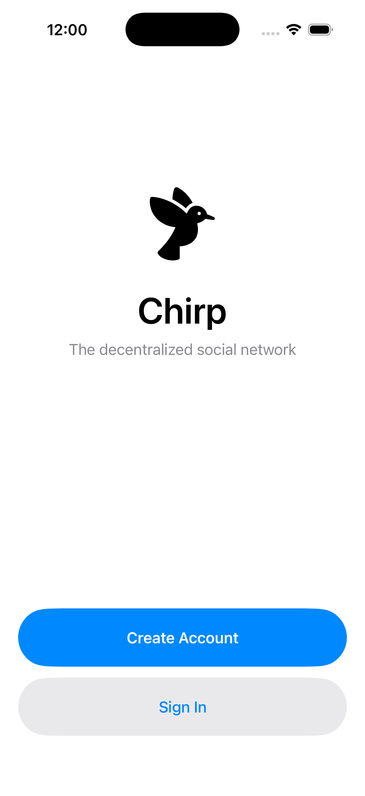
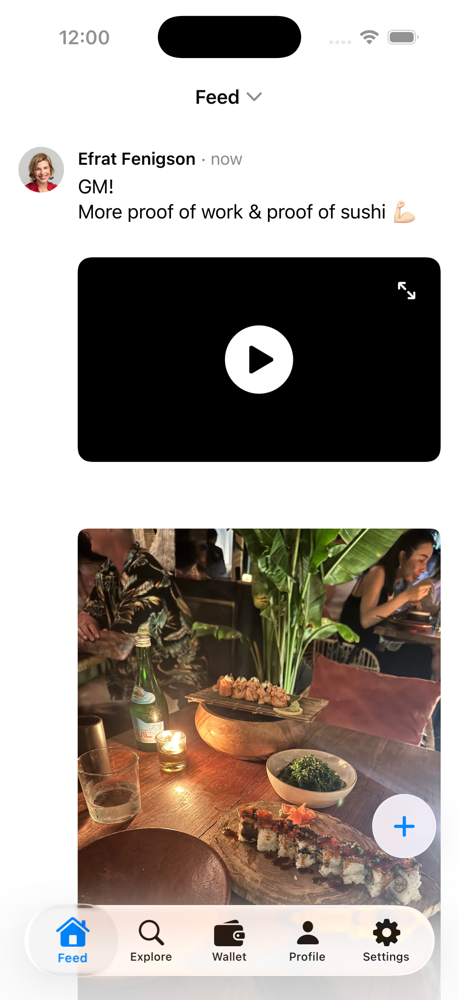
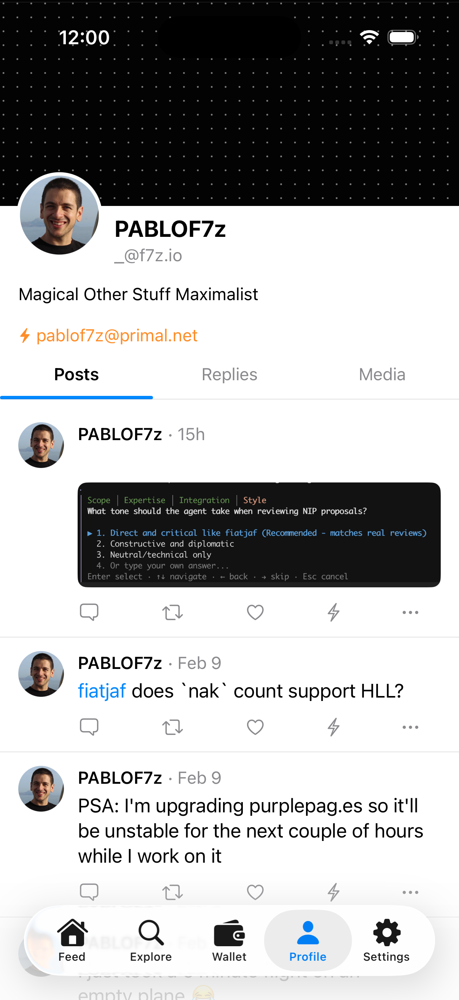
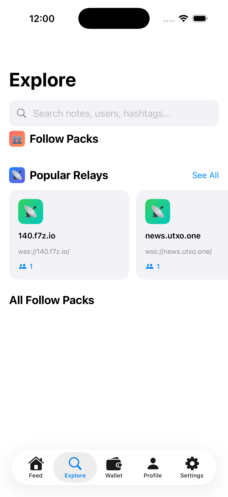
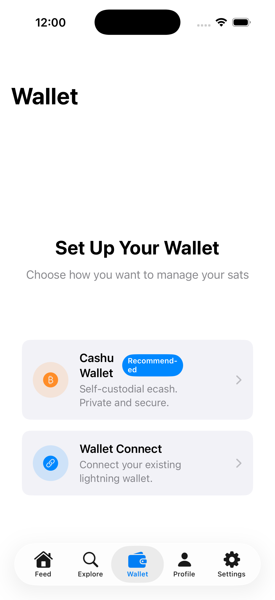
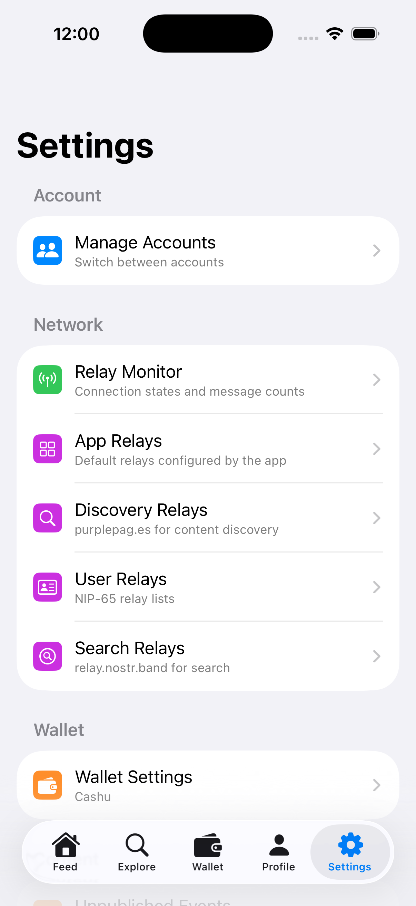

# Chirp

Chirp is a reference Nostr social client built with [NDKSwift](https://github.com/pablof7z/NDKSwift). It demonstrates the full capabilities of the NDK Swift libraries in a production-quality iOS application.

**iOS 17.0+** | **Swift 6.0** | **SwiftUI**

<p align="center">
  
  
  
</p>

## Features

### Social Feed
A real-time feed of posts from people you follow, with support for multiple feed sources:
- **Follow-based feed** -- posts from your contact list
- **Follow Packs** -- curated groups of users you can subscribe to
- **Relay feeds** -- browse posts from specific relays

Posts render rich content including images, videos, embedded notes, user mentions, and hashtags. Pull-to-refresh and infinite scroll are supported.

<p align="center">
  
  
  
</p>

### Explore
Discover new content and people through:
- Full-text search for notes, users, and hashtags (NIP-50)
- Follow Packs for quick bulk-following
- Popular relay discovery with connection stats

### Profiles
User profiles with banner images, NIP-05 verification badges, follow/unfollow actions, and a tabbed view of posts, replies, and media.

### Composer
Write and publish notes with rich text composition, reply threading with parent note context, and content warnings.

### Wallet
Integrated Bitcoin/Lightning wallet with two options:
- **Cashu Wallet (NIP-60)** -- self-custodial ecash with multi-mint support, deposit monitoring, and Lightning payments
- **Nostr Wallet Connect (NIP-47)** -- connect an external Lightning wallet for balance checking, payments, and invoice creation

### Authentication
Multiple sign-in methods:
- Private key (nsec/hex) stored securely in the device keychain
- NIP-46 remote signer (bunker) for enhanced key security
- Read-only mode with just an npub
- Multi-account support with easy switching

### Relay Management
Comprehensive relay configuration:
- App relays (defaults)
- User relays (NIP-65 relay lists)
- Discovery relays (purplepag.es)
- Search relays (relay.nostr.band)
- Live relay connection monitoring with message counts

### Developer Tools
A full suite of diagnostic tools for Nostr development:
- NostrDB Inspector -- database indexes, event counts, storage metrics
- Event Inspector -- search and browse cached events
- Subscription Monitor -- active subscriptions and REQ optimization
- Outbox Inspector -- relay selection and user tracking
- Relay Dashboard -- live connection metrics
- Log Viewer -- real-time NDK log output
- Cache Management -- database inspection and cleanup

## Supported NIPs

| NIP | Description |
|-----|-------------|
| NIP-01 | Basic protocol flow |
| NIP-02 | Follow lists |
| NIP-05 | DNS-based identity verification |
| NIP-11 | Relay information document |
| NIP-18 | Reposts |
| NIP-25 | Reactions |
| NIP-46 | Nostr Connect (remote signing) |
| NIP-47 | Nostr Wallet Connect |
| NIP-50 | Search |
| NIP-60 | Cashu wallet |
| NIP-65 | Relay list metadata |
| NIP-87 | Cashu mint discovery |

## Architecture

Feature-based organization with `@Observable` state management:

```
ChirpFeature/
├── App/           Core state, login, navigation
├── Composer/      Post creation
├── Feed/          Home feed, threading
├── Explore/       Discovery, search, packs
├── Profile/       User profiles
├── Wallet/        Cashu + NWC payments
├── Settings/      Configuration, relays
├── DevTools/      Debugging utilities
└── DesignSystem/  UI components and theming
```

### Dependencies

All from the NDKSwift monorepo:

- `NDKSwiftCore` -- core Nostr protocol
- `NDKSwiftUI` -- pre-built UI components
- `NDKSwiftNostrDB` -- event caching with NostrDB
- `NDKSwiftCashu` -- NIP-60 Cashu support

## Building

Open `Chirp.xcodeproj` in Xcode 16+ or generate the project from `project.yml` using [XcodeGen](https://github.com/yonaskolb/XcodeGen):

```bash
cd Examples/Apps/Chirp
xcodegen generate
```

Select the `Chirp` scheme, choose a simulator or device, and build.

## URL Schemes

```
chirp://nip46/      Remote signer callbacks
chirp://nwc?value=  Wallet Connect callbacks
```
